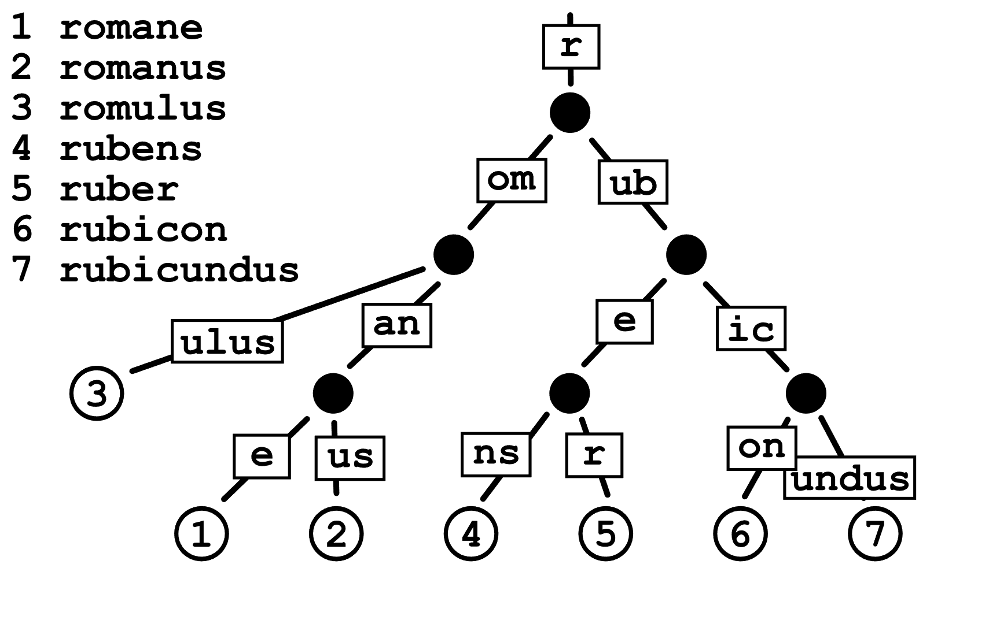
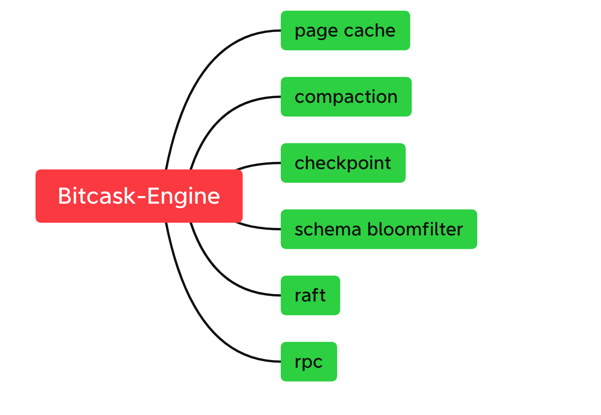

# bitcask-engine


### 设计思想

- 每个schema在内存中保存的art树，叶子节点保存了所有key-value所在文件的偏移量，内存中保存的都是schema中最新的数据，每个schema中磁盘文件中的key-value都是以`append`方式进行写入，所以后续需要做`compaction`.
- 当需要根据key获取数据的时候，首先找到对应的schema,然后在schema中的`art`树中找到对应key-value的meta信息，然后去读取schema的文件数据，最终返回给用户。所有的写操作都是`顺序写`操作，读操作都是根据文件描述符进行`seek`和`read`操作，因为目前这个仅仅是一个雏形，优化的空间很大。

### ART树介绍


### 编译bitcask库

```shell
$ git clone git@github.com:perrynzhou/bitcask-engine.git && cd src  && make clean && make 
```

### 编译bitcask测试

```shell
$ cd test && make clean && make
```

## 未来计划

